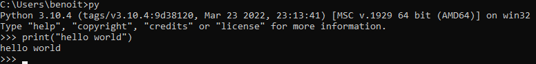
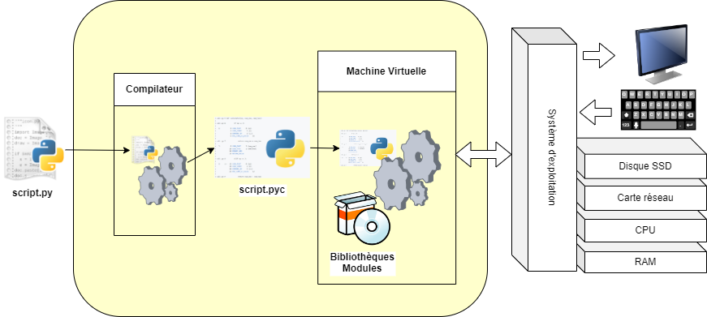
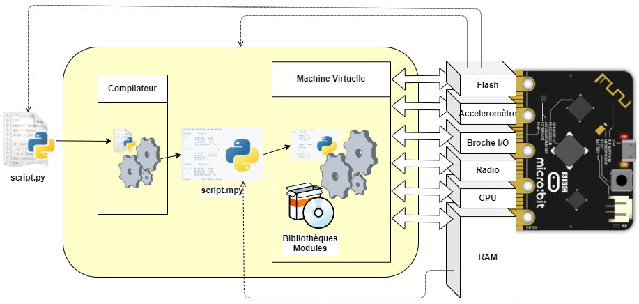

# Généralités
## Qu'est Python
Python[^1] est un langage de programmation **interprété**, **multi-paradigme** et **multiplate-forme**. Il favorise la programmation impérative structurée, fonctionnelle et orientée objet. Il est doté d'un typage dynamique fort, d'une gestion automatique de la mémoire par ramasse-miettes et d'un système de gestion d'exceptions.

Aujourd'hui, python est soutenue par *Python Software Fondation*, PSF. Cette organisme se donne pour mission :

- d'éditer les spécifications de python (les fameuse *PEP*, python enhancement proposal)
- de maintenir une plateforme de gestion de paquet Pypi[^4]
- de maintenir une version de python *cpython*
- ...

PSF est présidé par le créateur de python en 1991, Guido Von Rossum.

Il existe en fait de nombreuses version de python:

- **CPython**[^cpython] : la version **officiel** de référence. L'interpreteur est écrit en c est compilé pour de nombreuse plateforme (OS : windows, linux, Mac, plusieurs version d'unix ; processeur ARM, x86, AIX, AS/400).
- **MicroPython**[^6] : implémentation légère de python en `C` à destination des microcontrôleurs (principalement les architectures ESP(c) et ARM(c), mais fonction sous windows et linux).
- **Jython** : le code python est compilé en *bytecode* `Java` pour être interpréter sur une machine virtuelle Java. Cela permet un grande interopérabilité entre Java et Python.
- **IronPython** : implémentation .NET (Microsoft) écrit en `C#` pour permette l’interopérabilité de code .NET et Python.
- **PyPy** : interpréteur python écrit en `python`.

Nous ne nous attarderons que sur les deux premières implémentations. Les explications données ci-dessous sont valable pour CPython. Nous mettrons en lumière quelques differences avec MicroPython.

## Langage interprété
### Un peu de vocabulaire

En informatique, un interpréteur[^2] est un outil dont la tâche est d'analyser, de traduire et d'exécuter les programmes écrits dans un langage informatique. 

Un interprète se distingue d’un compilateur par le fait qu’il effectue l’analyse et la traduction nécessaires à l'exécution d’un programme donné non pas une fois pour toutes, mais à chaque exécution de ce programme. L’exécution nécessite ainsi de disposer non seulement du programme, mais aussi de l’interpréteur correspondant. 

Python est un langage interprété car le programme python nécessite un programme tiers pour être exécuté. Contrairement à un programme C compilé qui est nativement exécutable par la machine, le code python va subir plusieurs traitements avant de pouvoir être exécuter.

Lorsque l'**interpréteur python** démarre il propose une invite de commande dans laquelle on peut écrire du code en **langage python**.



Cette fenêtre austère se nomme REPL : Read–eval–print loop [^3].

On appelle **script python** un fichier `.py` contenant des commandes python dont les lignes seront interprétées l'une après l'autre par l'interpréteur.

### Interprété ou compilé ?
On parle bien d'interprété puisque le code est ré-évalué à chaque exécution. Cependant, l'évaluation n'est pas immédiate :



1. Le logiciel `python.exe` est lancer et le programme script.py lui est transmis en exécutant `python fichier.py`
2. `python.exe` analyse **script.py** pour en vérifier la syntaxe
3. `python.exe` compile **script.py** en langage de bas niveau indépendant de la plateforme appelé *bytecode*. Le fichier créé s'appelle **script.pyc**. Le *bytecode* ressemble à un code assembleur.
4. `python.exe` active ensuite une machine virtuel qui va faire exécuter à l'ordinateur les ligne du fichier `script.pyc` instruction par instruction en utilisant les bibliothèques et module de l'environnement python. 
5. Comme pour n'importe quel programme, lorsque la machine virtuelle à besoin d'accéder à des périphériques (clavier, écran, souris, carte réseau), d'allouer de la mémoire, etc...  `python.exe` fait des appels système au système d'exploitation pour réalisé l'action.

Voici ce à quoi ressemble le bytecode Python :

=== "Python"
	``` py
	>>> def hello():
	...     print("Hello World!")
	```

=== "Bytecode"
	``` py
	>>> import dis
	>>> dis.dis(hello)
	2           0 LOAD_GLOBAL              0 (print)
				2 LOAD_CONST               1 ('Hello World!')
				4 CALL_FUNCTION            1
				6 POP_TOP
				8 LOAD_CONST               0 (None)
				10 RETURN_VALUE
	```

### MicroPython dans tout ça ?

L'implémentation MicroPython correspond à la version 3.5 de CPython (contre 3.11 pour la version actuelle).

MicroPython porte l'essentielles des fonctionnalité de python. Même si certaines interface de programmation ont été simplifiées et que l'implémentation des fonctions est simplifié, le résultat est étonnamment complet, léger et performant.



En ce qui concerne MicroPython, le principe d'interprétation du code est le similaire. Apportons quelques compléments:

- Sur un microcontrôleur ou est installé MicroPython, c'est lui qui fait office de **système d'exploitation** :
	- **Abstrait le matériel** pour offrir une interface de programmation identique quelque soit la plateforme
	- Gère la **mémoire**[^memoire]
	- Gère les **tâches** et le multitâche dans une certaine mesure. 
- MicroPython n'est "rien d'autre" qu'un **programme écrit en **`C` compilé pour s'exécuter sur le microcontrôleur.
- **MicroPython** est stocker en mémoire de masse, souvent la mémoire **flash**
- Les fichier `.py` sont stocker en mémoire **flash**
- Les fichier `.mpy` ne sont pas stocker et compiler à chaque redémarrage du système quand on fait appel à la directive `import`. Le ***bytecode* est stocké en RAM** sur certaines plateforme il est possible de précompilé les fichier .py en .pyc à l'aide de `mpy-tool.py`[^mpy-tools] ou `mpy_cross`[^mpy_cross]
- Micropython est **modulaire** : à la compilation on peut choisir les modules qui seront disponible.


!!! note "A propos du multitâche"
	A propos de la gestion des tâche il n'est pour l'instant pas possible d'utiliser un ordonnanceur préemptif mais il est possible d'utiliser une ordonnanceur collaboratif avec la bibliothèque `asyncio`, de faire des calculs parallèle sur les microcontrôleurs multi-coeur avec la bibliothèque `_thread`, ou de gérer des routines d'interruption (détection de front sur les broche, timers)


## Langage multi-paradigme

Python est dit multi-paradigme. Un paradigme en programmation est une façon de décrire le comportement d'un programme.

On parle de programmation :

- **Impérative** : permet des approches de programmation impérative (séquence, affectation, branchement conditionnel *si*, branchement *goto*, boucle)
- **Fonctionnelle** : la programmation consiste à déclarer des fonctions et leurs conditions d'exécution. L'environnement d'exécution se charge de constituer la pile d'appel en "branchant" les valeurs retournée par les fonctions sur les paramètre d'entrée d'autres fonctions. La programmation fonctionnelle abouti à des programmes sans état, il ne peut pas exister de variable partagée à l'extérieur d'une fonction. 
- **Orienté objet** : la programmation orienté objet fait de l'objet l'entité de base. Un objet possède un état intrinsèque contenu dans ses attribut et des méthodes que l'on peut appeler pour que l'objet opère des actions sur ses propres attribut, modifiant ainsi l'état d'exécution du programme.

## Langage multi-plateformes

[^cpython]: [https://www.python.org/ ](https://www.python.org/)
[^6]: [https://micropython.org/ ](https://micropython.org/)
[^1]: [ https://fr.wikipedia.org/wiki/Python_(langage) ](https://fr.wikipedia.org/wiki/Python_(langage))
[^2]: [ https://fr.wikipedia.org/wiki/Interpr%C3%A8te_(informatique)](https://fr.wikipedia.org/wiki/Interpr%C3%A8te_(informatique))
[^3]: [ https://en.wikipedia.org/wiki/Read%E2%80%93eval%E2%80%93print_loop](https://en.wikipedia.org/wiki/Read%E2%80%93eval%E2%80%93print_loop)
[^4]: [ https://pypi.org/](https://pypi.org/)
[^memoire]: [La gestion de la mémoire par python](../python_type/#la-gestion-de-la-memoire-par-python)
[^mpy_cross]: [Compilateur MicroPython multi-plateformes](https://pypi.org/project/mpy-cross/)
[^mpy-tools]: [Compilateur MicroPython officiel](https://docs.micropython.org/en/latest/reference/mpyfiles.html?highlight=mpy)
