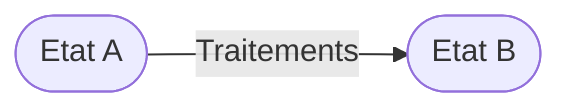
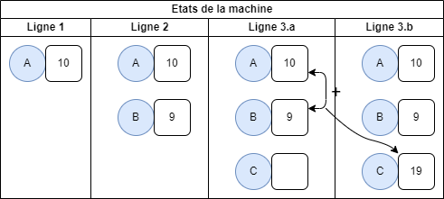

# Python et l'objet

## Introduction

Considérons deux aspects des traitements informatiques:

* l'information : c'est ce qui caractérise l'état de la machine 
* les traitements : les traitements vont permettre de passer d'un état initial à un état final



## La programmation impérative

On connaît les variables qui symbolisent des informations.
On connaît également l'opérateur d'affectation qui permet de modifier l'état d'une variable en fonction de :

* Une ou plusieurs variable
* Un opérateur ou une fonction

Une variable se définit par :

- son type
- son nom

``` py linenums="1"
a = 10
b = 9
c = a + b
# c symbolise le contenu d'un espace mémoire contenant la valeur 19
```



!!! definition "Programmation impérative"
    L'état de la machine est caractérisée par :

    - le contenu des variables 
    - l'instruction en cours de traitement (pointeur d'instruction)

    Les traitements sont :

    - les instructions en cela que le passage d'une instruction à l'autre modifie le pointeur d'instruction
    - l'opérateur d'affectation


## La programmation orientée objet

!!! definition "Programmation orienté objet"
    L'état de la machine est caractérisée par :

    - les relations entre les objets
    - l'état des attributs des objets

    Les traitements sont :

    - Les méthodes permettant d'accéder aux attributs d'un objet.


## L'objet en python'